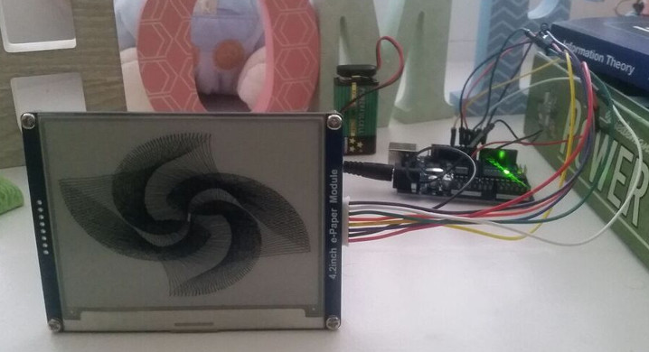

# Harmonograph Renderer

A small project I developed over xmas 2018 to produce this
Arduino-based device:

TODO IMG

The code renders a harmonograph image to the screen as freqeuently as
it can, which is around one image per minute on a standard Arduino Uno
(the code is inefficient, but does the job). 

## Software

- `harmonograph-sdl2`: C++ software implementation of a harmonograph. Was
  developed against the target Arduino hardware (e.g. rendering into a
  bitbuffer), rather than being clean or fast. Put in this repo for archiving
  
- `harmonograph-arduino-uno`: Arduino code for the device. Developed +
  uploaded through standard Arduino IDE (v1.8.8).

## Hardware

- Arduino Uno (I used
  [this](https://www.amazon.co.uk/Project-Complete-Ultimate-TUTORIAL-controller/dp/B01IUY62RM/ref=sr_1_5?s=computers&ie=UTF8&qid=1546344449&sr=1-5&keywords=elegoo+starter+kit)
  kit one)

- Waveshare 4.2 inch E-Ink Display Module ([amazon](https://www.amazon.co.uk/Waveshare-Resolution-Electronic-Interface-Raspberry/dp/B0751J99PS/ref=sr_1_7?s=computers&ie=UTF8&qid=1546344642&sr=1-7&keywords=waveshare+4.2))

- ~8 jumper cables

- A box (mine's a custom-made thing)

## Assembly

- Wire the screen up to the Arduino according to standard manufacturer
  guide (see
  [here](https://www.waveshare.com/wiki/4.2inch_e-Paper_Module))
  
- Connect Arduino to computer

- Upload `harmonograph-arduino-uno` project to the Arduino

- Put it in a nice box

## Known Limitations

- Algorithm is unoptimized: takes ~1 min of constant computation to
  render an image
  
- Because of the above, cannot run the device on a battery (too much
  drain to run it for multiple days)
  
- Doesn't randomize the various harmonograph parameters (weightings,
  phases, etc.)
